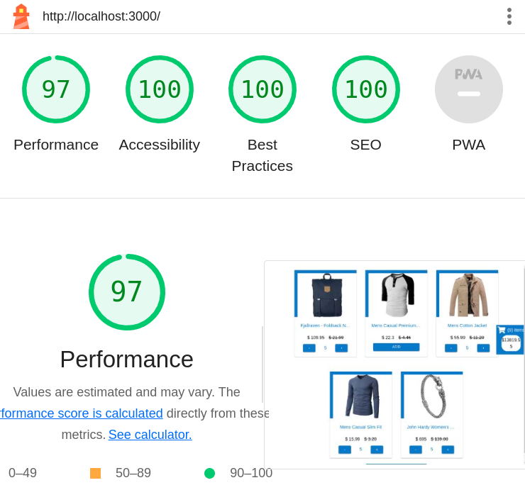

# Code Example

## Nextjs-Graphql-Typescript

[](https://kqwcnx-3000.csb.app) <= Preview Live

## This is an example of a couple of responsive features for an eccommerce following the best development practices and design paterns.

There were made intended to be performant so it has 97 for performance and 100 in the other green flags for each topic when running lighthouse test on it, but could be better with other techniques that i didn't use because this version is not for production.



## Features

- \***\*Product cards with pagination\*\***
  A product grid with pagination(as much as possible because i used a public product api, so it doesn't have pagination on server)

- \***\*Cart\*\***
  Crafted using TDD so it's well tested with react testing library
  Uses graphql as state manager and localstorage for persistence.

## The most interesting thing

The fact that i used a HOC (High Order Component) for the buttons that handle products to the cart so that component could be reused across all the app in different places like i did in the product grid item and the open cart. Making a set of buttons full customizable (container, add product, button plus , button minus, quantity, colors, type of button) that are injected with the cart hook state so the set of buttons are capable of (add, increment, decrease, remove, show quantity) products into the cart state manager.

## Installation

Code Example requires [Node.js](https://nodejs.org/) v10+ to run.

```sh
cd typescript-nextjs-graphql-example
npm run hire
```

## License

MIT
**Free Software, Hell Yeah!**
